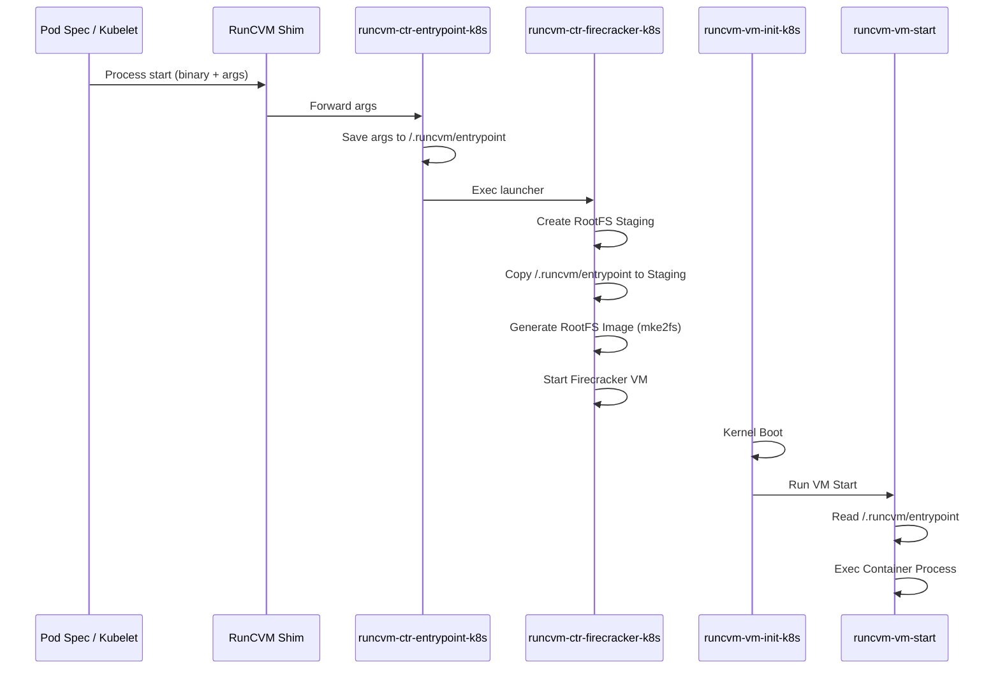

# RunCVM Entrypoint Injection in Kubernetes

RunCVM enables running containers inside Firecracker MicroVMs. A critical part of this is ensuring the `command` and `args` defined in a Kubernetes Pod spec are correctly executed inside the VM.

## Architecture

The injection process follows a multi-stage path from the Kubernetes Host into the Guest VM:



## Key Components

### 1. Host-Side Capturing (`runcvm-ctr-entrypoint-k8s`)
When Kubernetes starts a container, the RunCVM shim receives the original execution command. This script captures all arguments and saves them line-by-line to a temporary file at `/.runcvm/entrypoint` on the host side of the container.

### 2. RootFS Injection (`runcvm-ctr-firecracker-k8s`)
The Firecracker launcher is responsible for building the Guest VM's root filesystem from the container image. It explicitly copies the captured `entrypoint` file into the staging directory before creating the final ext4 image.

> [!IMPORTANT]
> The entrypoint must be injected into `/.runcvm/entrypoint` inside the guest to match the path expected by the guest-side scripts.

### 3. Guest-Side Execution (`runcvm-vm-start`)
Once the VM boots, the guest init system eventually calls `runcvm-vm-start`. This script:
- Loads the content of `/.runcvm/entrypoint`.
- Reconstructs the positional parameters (`set --`).
- Uses `exec "$@"` to replace the shell with the intended container process (e.g., `nginx`).

## Troubleshooting

### "No entrypoint found" Error
If you see `[VM-START] No entrypoint found, sleeping` in the logs, it usually means:
1.  **Path Mismatch**: The host script saved the entrypoint to a location different from where the guest script expects it (e.g., `/.runcvm-entrypoint` vs `/.runcvm/entrypoint`).
2.  **Mount Issues**: The host-side captured file was not correctly included in the `mke2fs` staging directory.

### Logging Visibility
Host-side logs for the launcher are captured by the container runtime (e.g., `containerd` in K3s) and visible via `kubectl logs`.

> [!TIP]
> If `kubectl logs` is empty despite the pod being `Running`, the log level might be too low. Set `RUNCVM_LOG_LEVEL=DEBUG` in your Pod environment.
> If `kubectl logs` still shows nothing, you can retrieve the raw logs directly from the Kubernetes Node (e.g., Colima VM):
> ```bash
> # Inside Colima SSH
> sudo crictl ps | grep <pod-name>
> sudo crictl logs <container-id>
> ```

### Debugging with `debugfs`
To verify if the entrypoint made it into the image without booting the VM, you can use `debugfs` on the host side:
```bash
debugfs -R "ls -l /.runcvm" /rootfs.ext4
```
